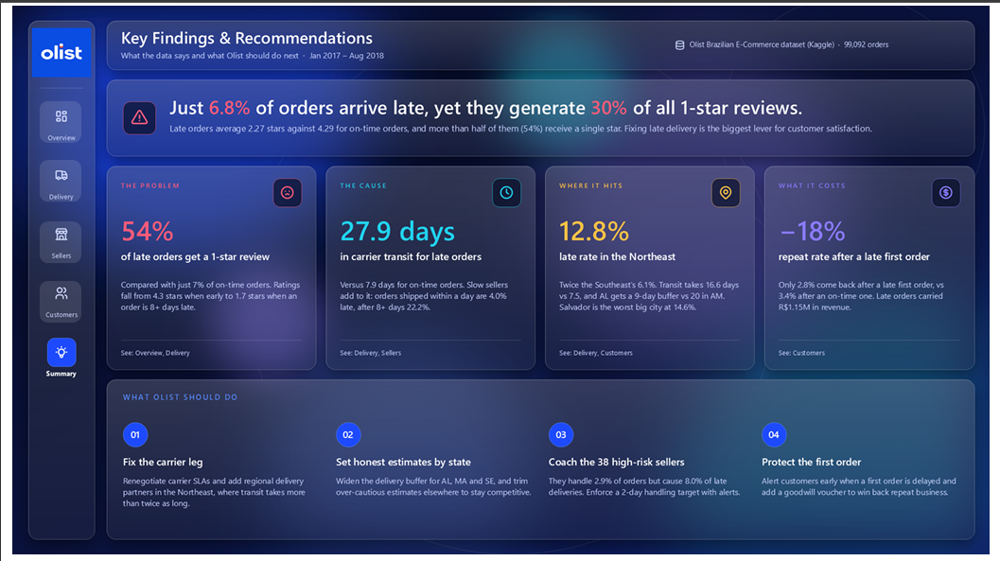
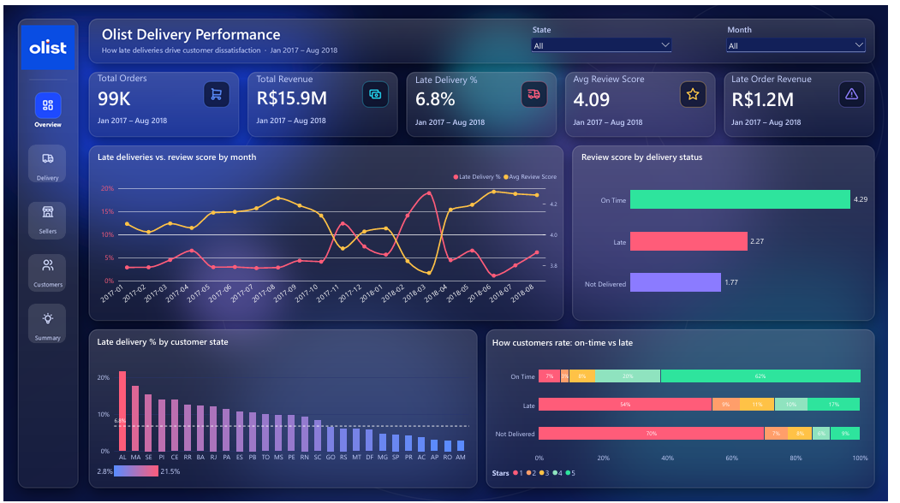
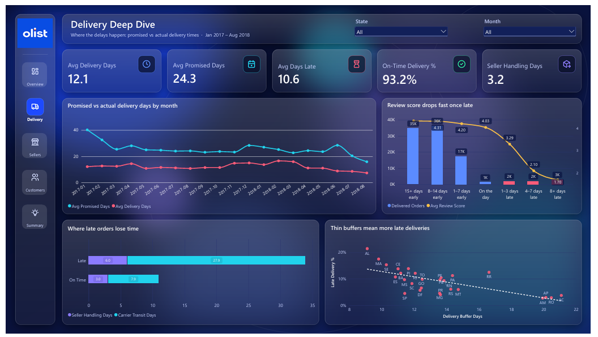
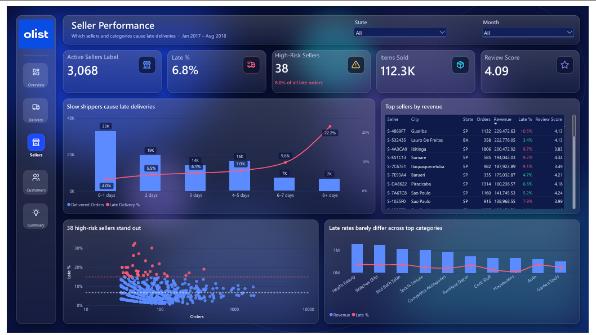
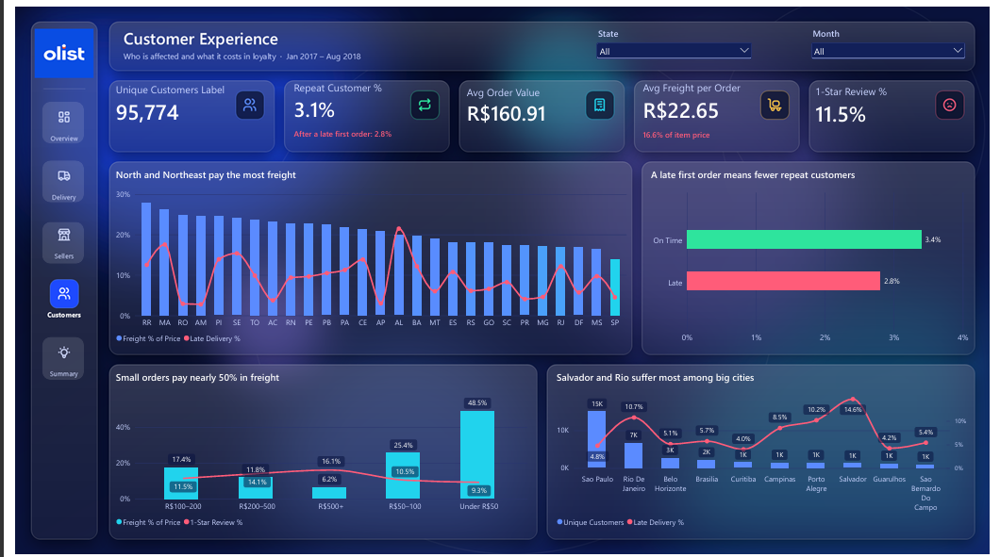

# Olist Delivery Performance Dashboard (Power BI)

**How late deliveries drive customer dissatisfaction at a Brazilian e-commerce marketplace**

> Just **6.8%** of orders arrive late, yet they generate **30%** of all 1-star reviews.

An end-to-end Power BI project analysing **99,092 real orders** from Olist, a Brazilian e-commerce marketplace. The report covers data cleaning in Power Query, a star-schema data model, advanced DAX, and a custom glassmorphism design with page navigation, and it ends with concrete business recommendations.



---

## Table of contents

- [Business problem](#business-problem)
- [Dataset](#dataset)
- [Report pages](#report-pages)
- [Key findings](#key-findings)
- [Recommendations](#recommendations)
- [Data preparation](#data-preparation)
- [Data model](#data-model)
- [DAX highlights](#dax-highlights)
- [Design](#design)
- [Repository structure](#repository-structure)
- [How to open the report](#how-to-open-the-report)
- [Author](#author)

---

## Business problem

Olist connects small and medium-sized sellers to large Brazilian marketplaces and handles the logistics in between. Customer reviews are a key driver of marketplace ranking and repeat business, so the central question of this project is:

**How much do late deliveries hurt customer satisfaction and loyalty, what causes them, and where should Olist act first?**

## Dataset

- **Source:** [Brazilian E-Commerce Public Dataset by Olist](https://www.kaggle.com/datasets/olistbr/brazilian-ecommerce) on Kaggle
- **Size:** about 100,000 orders across 9 CSV files (orders, order items, customers, sellers, products, payments, reviews, category translation and geolocation)
- **Analysis window:** January 2017 to August 2018. The months before 2017 and after August 2018 contain very few orders (for example, only 16 orders in September 2018 against 6,512 in August), so they are excluded with a page-level filter to avoid misleading month-over-month comparisons.

## Report pages

| Page | Question it answers |
|---|---|
| **Summary** | What are the key findings, and what should Olist do? |
| **Overview** | How big is the late-delivery problem, and how does it affect reviews over time? |
| **Delivery Deep Dive** | Where in the delivery process is time lost, and how fast do reviews fall as orders get later? |
| **Seller Performance** | Which sellers and shipping behaviours cause late deliveries? |
| **Customer Experience** | Who is affected, what do they pay for shipping, and do they come back? |

<table>
  <tr>
    <td></td>
    <td></td>
  </tr>
  <tr>
    <td></td>
    <td></td>
  </tr>
</table>

## Key findings

**1. The problem: late orders destroy ratings.**
Late orders average **2.27 stars** against **4.29** for on-time orders, and **54%** of late orders receive a 1-star review, compared with **7%** of on-time orders. Ratings fall step by step with lateness: 4.3 stars when an order arrives early, 3.3 when it is 1 to 3 days late, 2.1 at 4 to 7 days, and **1.7 at 8+ days late**. The three worst months for late deliveries (November 2017, February 2018 and March 2018) are also the three worst months for reviews.

**2. The cause: carrier transit, amplified by slow sellers.**
Olist promises delivery in **24.3 days** on average and delivers in **12.1**, yet late orders still happen. Late orders spend **27.9 days** in carrier transit against **7.9 days** for on-time orders. Seller handling matters too: orders handed to the carrier within one day are late **4.0%** of the time, while orders that take 8+ days to ship are late **22.2%** of the time.

**3. Where it hits: the North-East.**
The North-East has a **12.8%** late rate, twice the South-East's **6.1%**, with average carrier transit of 16.6 days against 7.5. States with the thinnest safety buffer between promised and actual delivery time are hit hardest: Alagoas (AL) gets a 9-day buffer and is late **21.5%** of the time, while Amazonas (AM) gets a 20-day buffer and is late only **2.8%**. Among large cities, Salvador is worst at **14.6%** late. North-Eastern and Northern customers also pay the most for shipping, with freight at up to **27.8%** of item price (Roraima) against **13.8%** in São Paulo.

**4. What it costs: lost repeat customers.**
Only 3.1% of customers ever order twice, and a late first order makes that even less likely: **2.8%** return after a late first order against **3.4%** after an on-time one, an **18% lower** repeat rate. Late orders carried **R$1.15M** in revenue over the period.

**5. A small group of sellers does outsized damage.**
**38 high-risk sellers** (30+ orders and a late rate of 15% or more) handle just **2.9%** of orders but cause **8.0%** of all late deliveries. Late rates barely differ across the top product categories (roughly 5% to 7.5%), which suggests the issue is how orders are shipped rather than what is sold.

## Recommendations

1. **Fix the carrier leg.** Renegotiate carrier service levels and add regional delivery partners in the North-East, where transit takes more than twice as long.
2. **Set honest estimates by state.** Widen the delivery buffer for AL, MA and SE, and trim overly cautious estimates elsewhere to stay competitive.
3. **Coach the 38 high-risk sellers.** Enforce a 2-day handling target with automated alerts, since fast handling cuts the late rate from 22% to 4%.
4. **Protect the first order.** Alert customers early when a first order is delayed, and offer a goodwill voucher to recover the repeat purchase.

## Data preparation

All cleaning was done in **Power Query**:

- Loaded 8 of the 9 files (geolocation was excluded, since the state and city fields in the customer and seller tables were sufficient).
- Set correct data types for all date/time, numeric and text columns.
- Fixed a parsing issue in the reviews file, where comments containing line breaks were being split into broken rows, by changing the CSV quote style to `QuoteStyle.Csv`.
- Merged the product table with the category translation table to get English category names, with a fallback to the Portuguese name and `"Unknown"` for missing values, then formatted them for display (for example, `health_beauty` becomes `Health Beauty`).
- Added calculated columns to the orders table: **Purchase Date**, **Delivery Status** (On Time, Late or Not Delivered), **Delivery Days** and **Delay Days**.
- Standardised city names to proper case.

```m
// Delivery Status column in Power Query
if [order_status] <> "delivered" or [order_delivered_customer_date] = null then "Not Delivered"
else if Date.From([order_delivered_customer_date]) > Date.From([order_estimated_delivery_date]) then "Late"
else "On Time"
```

## Data model

A **star schema** with **Orders** as the central fact table:

```
Calendar ──1:*──► Orders ◄──*:1── Customers
                    │
       ┌────────────┼────────────┐
       ▼            ▼            ▼
   OrderItems    Payments     Reviews
    ▲      ▲
    │      │
 Products  Sellers
```

- All relationships use **single-direction** filtering to keep the model fast and predictable.
- Where a filter needs to travel "upstream" (for example, from Sellers or Products through OrderItems back to Orders), bidirectional filtering is enabled **only inside specific measures** with `CROSSFILTER`, rather than on the relationship itself.
- A dedicated **Calendar** table is built in DAX and marked as the date table, with Power BI's Auto date/time disabled.
- All measures live in a dedicated `_Measures` table.

## DAX highlights

**Calendar table**

```dax
Calendar =
ADDCOLUMNS(
    CALENDAR(DATE(2016,1,1), DATE(2018,12,31)),
    "Year", YEAR([Date]),
    "Month Number", MONTH([Date]),
    "Month", FORMAT([Date], "MMM"),
    "Year-Month", FORMAT([Date], "YYYY-MM"),
    "Quarter", "Q" & QUARTER([Date])
)
```

**Core delivery measures**, using `KEEPFILTERS` so the measure respects the existing filter on Delivery Status instead of overwriting it:

```dax
Late Orders =
CALCULATE([Total Orders], KEEPFILTERS(Orders[Delivery Status] = "Late"))

Late Delivery % = DIVIDE([Late Orders], [Delivered Orders])
```

**Month-over-month comparison**, with a guard against the sparse data before 2017:

```dax
Late % PM =
IF(MIN('Calendar'[Date]) < DATE(2017,2,1), BLANK(),
    CALCULATE([Late Delivery %], DATEADD('Calendar'[Date], -1, MONTH)))
```

**Dynamic KPI labels and colours**, which power the ▲▼ indicators on the KPI cards:

```dax
Late % Delta Label =
VAR c = [Late % Change]
RETURN
IF(NOT HASONEVALUE('Calendar'[Year-Month]), "Jan 2017 – Aug 2018",
    IF(ISBLANK([Late % PM]), "No prior month",
        IF(c >= 0, "▲ ", "▼ ") & FORMAT(ABS(c) * 100, "0.0") & " pts vs last month"))

Late % Delta Color =
IF(NOT HASONEVALUE('Calendar'[Year-Month]) || ISBLANK([Late % PM]), "#C9D3FF",
    IF([Late % Change] > 0, "#FF5C7A", "#2EE59D"))
```

**Seller-level analysis**, where `CROSSFILTER` lets a seller filter reach the Orders table:

```dax
Late Delivery % (Seller) =
CALCULATE([Late Delivery %], CROSSFILTER(OrderItems[order_id], Orders[order_id], BOTH))

High-Risk Sellers =
COUNTROWS(
    FILTER(
        VALUES(OrderItems[seller_id]),
        [Seller Orders] >= 30 && [Late Delivery % (Seller)] >= 0.15
    )
) + 0
```

**Iterators for process timing:**

```dax
Avg Promised Days =
AVERAGEX(
    FILTER(Orders, Orders[Delivery Status] <> "Not Delivered"),
    DATEDIFF(Orders[order_purchase_timestamp], Orders[order_estimated_delivery_date], DAY)
)
```

**Customer loyalty**, counting customers with two or more orders in the selected period:

```dax
Repeat Customers =
COUNTROWS(
    FILTER(
        CALCULATETABLE(
            VALUES(Customers[customer_unique_id]),
            CROSSFILTER(Orders[customer_id], Customers[customer_id], BOTH)
        ),
        [Total Orders] >= 2
    )
) + 0
```

**Other techniques used:** `SWITCH(TRUE(), ...)` bucketing columns with independent sort-order columns, `RELATED` and `ALLEXCEPT` for first-order detection, `REMOVEFILTERS` for a national benchmark line, `SELECTEDVALUE` and `CONTAINSSTRING` for conditional colouring, and `FORMAT` / `COALESCE` for clean card labels.

## Design

- **Glassmorphism background** designed in PowerPoint: a dark navy gradient with blurred colour blobs and genuinely frosted panels (the background is blurred inside each panel), exported at 1920 × 1080 and used as the canvas image.
- **Custom theme (JSON)** with a brand-matched palette, transparent visual backgrounds, white and soft-blue typography, and a styled filter pane.
- **Sidebar navigation** built from transparent page-navigation buttons with hover states.
- **Synced slicers** for state and month across all analytical pages. KPI cards respond to the month slicer, while the trend charts are set to ignore it so they always show the full story.
- **Consistent colour meaning** across every page: coral for late or bad outcomes, green for on-time or good outcomes, and blue for volume.

| Colour | Hex | Meaning |
|---|---|---|
| Primary blue | `#1F4BFF` | Brand, active navigation |
| Light blue | `#5B8CFF` | Volume, main series |
| Cyan | `#22D3EE` | Secondary series |
| Coral | `#FF5C7A` | Late deliveries, negative change |
| Gold | `#FFC247` | Review score |
| Violet | `#8B7BFF` | Supporting metrics |
| Mint green | `#2EE59D` | On time, positive change |

## Repository structure

```
├── Olist_Delivery_Dashboard.pbit     # Power BI template (report, model and DAX, without data)
├── Olist_Glass_Theme_v2.json         # Custom Power BI theme
├── Olist_Delivery_Dashboard.pdf      # PDF export of all pages
├── backgrounds/
│   └── Olist_Glass_Backgrounds_5_Pages.pptx
├── screenshots/
│   ├── summary.png
│   ├── overview.png
│   ├── delivery.png
│   ├── sellers.png
│   └── customers.png
└── README.md
```

## How to open the report

The full `.pbix` file (with data) is larger than GitHub's upload limit, so this repository contains a **Power BI template (`.pbit`)**: the complete report, data model, Power Query steps and DAX measures, without the data itself.

**Option A: open the full report directly**

Download the complete `.pbix` file from [Google Drive link](https://drive.google.com/file/d/1w8bkateyr8M58r86MWgskntWtHtUSWzN/view?usp=drive_link) and open it in Power BI Desktop.

**Option B: rebuild from the template**

1. Install [Power BI Desktop](https://powerbi.microsoft.com/desktop/) (free, Windows).
2. Download the dataset from [Kaggle](https://www.kaggle.com/datasets/olistbr/brazilian-ecommerce) and unzip it into a folder.
3. Open `Olist_Delivery_Dashboard.pbit`. Power BI will try to load the data from the original folder path and show an error; close the error.
4. Go to **Home → Transform data → Data source settings**, select the folder source, click **Change Source**, and browse to your unzipped dataset folder.
5. Click **Close**, then **Home → Refresh**. All pages will populate.
6. In Power BI Desktop, hold **Ctrl** and click the sidebar icons to move between pages.

## Author

**Prince Kofi Boame**

- LinkedIn: [My LinkedIn Profile](https://www.linkedin.com/in/prince-boame)
- Project post: [LinkedIn post link](https://www.linkedin.com/)

Feedback and suggestions are very welcome. Feel free to open an issue or reach out on LinkedIn.
